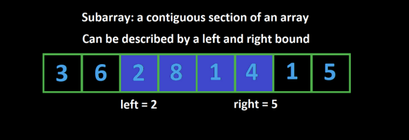

# Sliding Window 

Tag 🏷️Anki 

**Q**:What is a Subarray ? 

**Solution**:

A subarray is a contiguous section of an arary which can be described by a left and right bound



**Q**:What does the term "valid subarray" mean in array problems , and what two components define it ? 

**Solution**:

A “valid subarray” is one that meets a specific condition defined by the problem. It has two parts:

1. **Constraint metric** — an attribute of the subarray (e.g., sum, number of unique elements, frequency of an element).
2. **Numeric restriction** — a rule applied to that metric (e.g., sum ≤ 10).

A subarray is valid if its metric satisfies the restriction.

**Q**:Write the pseudocode for sliding window and its time complexity ? 

**Solution**:

```js
        
        
function fn(arr){
  let left = 0;
  for(let right = 0; right<arr.length;right++){
    // Do Some Logic to add elements at arr[right] to window
    
  }
  
  while (WINDOW_IS_INVALID){
    //Do some logic to remove element at arr[left] from window
    left++
  }
  Do some logic to update the answer
}
```

