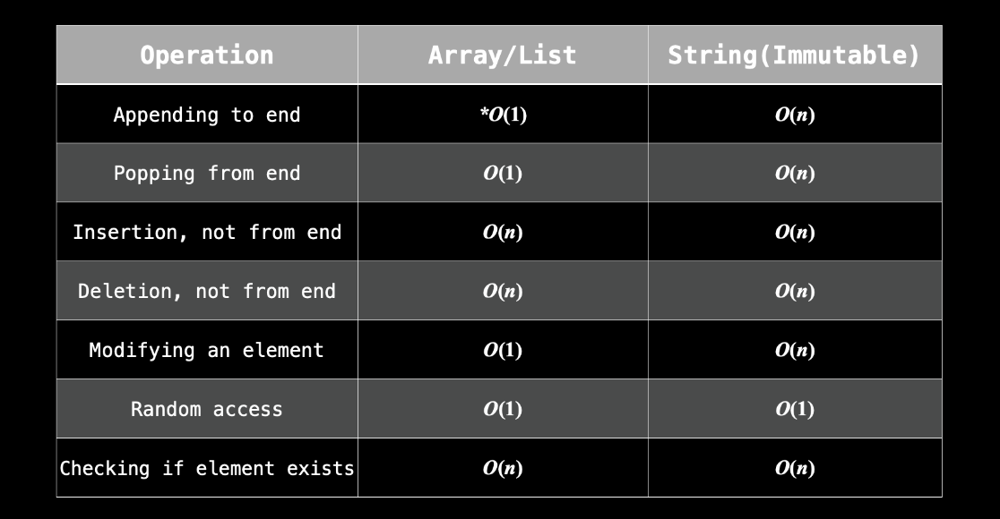

# Arrays and Strings 

**Q1**: Complete the following table ?

| Arrays/Strings | Mutable/Immutable |
| -------------- | ----------------- |
| Arrays         |                   |
| Strings        |                   |

**Solution**:

| Arrays/Strings | Mutable/Immutable |
| -------------- | ----------------- |
| Arrays         | Mutable           |
| Strings        | Immutable         |

**Q2**: Why should we care about something being mutable , immutable ? 

**Solution**:

Imagine you have a mutable array `arr = ["a", "b", "c"]` and an immutable string `s = "abc"`, and you want to change the `c` into a `d`. You can easily do `arr[2] = "d"`, but you cannot do `s[2] = "d"`. As such, if you wanted the string `s = "abd"`, you would need to create it entirely from scratch. With such a small  string, it's not a big deal. But sometimes you are dealing with strings  with 100,000 characters, so creating new versions just to modify one  character is very expensive (O(n), where n is the size of the string)

**Q3**:Time and Space Complexity of array and string operations 

| Operation                  | List | String(Immutable) |
| -------------------------- | ---- | ----------------- |
| Appending to end           |      |                   |
| Popping from end           |      |                   |
| Insertion , not from end   |      |                   |
| Deletion, not from end     |      |                   |
| Modifying an element       |      |                   |
| Random access              |      |                   |
| Checking if element exists |      |                   |

**Solution**:

